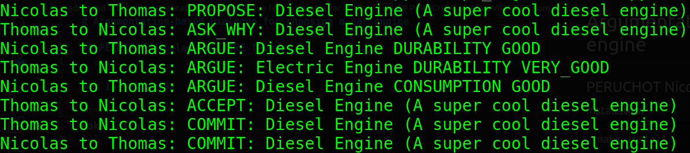

# Argumentation-based Dialogue for choosing a car engine

## PERUCHOT Nicolas, VICAIRE Thomas

## Example



Can be run with
```python
python pw_argumentation.py
```

This is the main script to run the argumentation. The two agents argue until one of them run out of arguments.

## Installation

```
make install
```

## Tests

Run tests for the preferences and arguments.

```
pytest
```


## Code

Explanation of our choices in critical files and classes.

### `src/agent/ArgumentAgent.py`

`ArgumentAgent` has the attribute `items_with_infos` which is of type `Dict[Item, Dict[CriterionName, CriterionValue]]` 

### `src/preferences/Preferences.py`

`Preferences` takes as a parameters a parameter of type `Dict[Item, Dict[CriterionName, CriterionValue]]` to keep track of all the preferences.

### `src/argumentation/Argument.py`

Each argument is a list of the following format: `[Item, CriterionName, CriterionValue]`.

We chose to implement three types of argument:
- `get_proposal` which allows to find the best or worst value for any criterion
- `get_counter_proposal` which allows the agent to counter an argument with a criterion that is more important for them than the one used by the opponent
- `get_other_item_with_better_value_for_same_criterion` which allows to find a better item for the criterion used by the opponent

Depending on the situation (the last used arguments for example), the agent chooses an argument strategy with `get_argument`.
